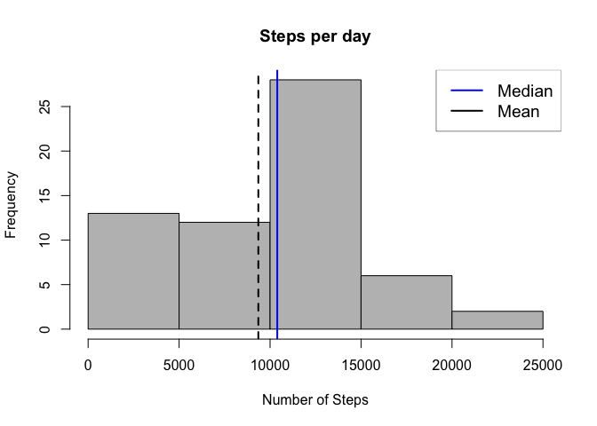
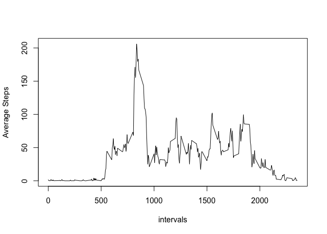
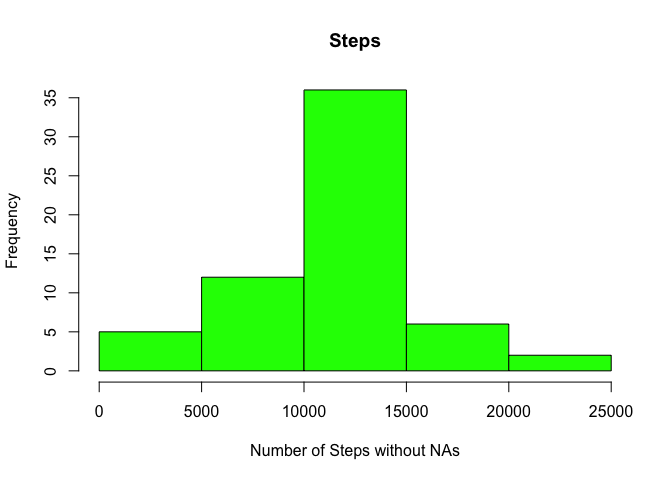
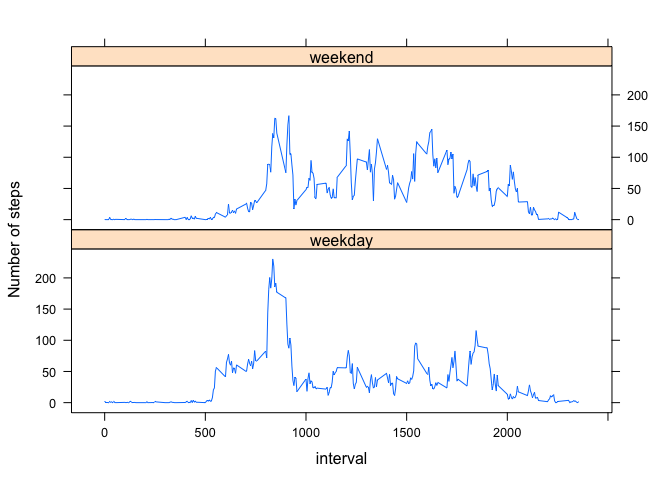

# Reproducible Research: Peer Assessment 1
##Introduction
The goal of this assignment is to generate a reproducible document that prepare, analyze and explain data about personal movement using activity monitoring devices such as a [Fitbit](http://www.fitbit.com), [Nike
Fuelband](http://www.nike.com/us/en_us/c/nikeplus-fuelband), or
[Jawbone Up](https://jawbone.com/up). 

This type of devices collects anonymous data at 5 minute intervals through out the day during two months (October and November, 2012 and include the number of steps taken in 5 minute intervals each day).

* Dataset: [Activity monitoring data](https://d396qusza40orc.cloudfront.net/repdata%2Fdata%2Factivity.zip) [52K]

The variables included in this dataset are:

* **steps**: Number of steps taking in a 5-minute interval (missing
    values are coded as `NA`)

* **date**: The date on which the measurement was taken in YYYY-MM-DD
    format

* **interval**: Identifier for the 5-minute interval in which
    measurement was taken

## Loading and preprocessing the data
loading the libraries

```r
library(dplyr)
library(lattice)
```
reading the csv file

```r
setwd("/Users/moufkir/Desktop/00-Coursera/Data_Science_Spesialization/Reproducible/W2A/RepData_PeerAssessment1/")
df<-read.csv("data/activity.csv", header = T, na.strings = "NA")
```

## What is mean total number of steps taken per day?


```r
day<-group_by(df, date)
stepsDays<- summarise(day, nsteps=sum(steps, na.rm = T))

hist(stepsDays$nsteps, col = "gray", xlab = "Number of Steps", main = "Steps per day")
abline(v=median(stepsDays$nsteps, na.rm = TRUE),lty=1,lwd=2, col="blue")
abline(v=mean(stepsDays$nsteps, na.rm = TRUE),lty=2,lwd=2,col="black")
legend("topright",lwd=2,col=c("blue","black"),c("Median","Mean"), cex=1.2,box.lwd=.5)
```

<!-- -->


## What is the average daily activity pattern?
### the maximum average steps is highlighted by the red horizontal line


```r
intervals <- group_by(df, interval)
intSteps<- summarise(intervals, average.steps = mean(steps, na.rm = TRUE))
plot(intSteps$interval, intSteps$average.steps, type="l", xlab = "intervals", ylab = "Average Steps") 
abline(h=filter(intSteps, average.steps==max(average.steps))[,2], lty=1, lwd=1, col="red")
```

<!-- -->


## Imputing missing values
### The total number of NAs

```r
 sum(is.na(df$steps))
```

```
## [1] 2304
```
### Devising the strategy for NAs values

```r
newdf<-df
for(intrv in intSteps$interval) {
  intrvMean <- as.numeric(intSteps[intSteps$interval==intrv,"average.steps"])
  len<- length(newdf[is.na(newdf$steps) & newdf$interval==intrv,"steps"])
 ## if(len >0){
   newdf[is.na(newdf$steps) & newdf$interval==intrv,"steps"]<-rep(intrvMean,len)
##  }
}

##write.table(newdf,file = "nonaactivity.csv", quote = F, sep = ";")
## Ploting the histogram
day<-group_by(newdf, date)
stepsDays<- summarise(day, nsteps=sum(steps, na.rm = T))
hist(stepsDays$nsteps, col = "green", xlab = "Number of Steps without NAs", main = "Steps")
abline(v=median(stepsDays$nsteps, na.rm = TRUE),lty=1,lwd=2, col="blue")
abline(v=mean(stepsDays$nsteps, na.rm = TRUE),lty=2,lwd=2,col="red")
legend("topright",lwd=2,col=c("blue","red"),c("Median","Mean"), cex=1.2,box.lwd=0.5)
```

<!-- -->


## Are there differences in activity patterns between weekdays and weekends?
###Create a new factor variable weekdays

```r
Sys.setlocale("LC_TIME", "en_US")
```

```
## [1] "en_US"
```

```r
wend<-c("Saturday", "Sunday")
##wend<-c("Samedi", "Dimanche")
newdf$weekdays<-sapply(weekdays(as.Date(newdf$date)), function(x) {ifelse(sum(grepl(x,wend, ignore.case = T))==0,"weekday","weekend")})
print(head(newdf))
```

```
##       steps       date interval weekdays
## 1 1.7169811 2012-10-01        0  weekday
## 2 0.3396226 2012-10-01        5  weekday
## 3 0.1320755 2012-10-01       10  weekday
## 4 0.1509434 2012-10-01       15  weekday
## 5 0.0754717 2012-10-01       20  weekday
## 6 2.0943396 2012-10-01       25  weekday
```

###Make a panel plot containing a time series plot

```r
stepsByIntrv<- newdf %>% group_by(interval, weekdays) %>% summarise(average.steps = mean(steps, na.rm = TRUE))
##plot(intSteps$interval, intSteps$average.steps, type="l", xlab = "intervals", ylab = "Average Steps") 

with(stepsByIntrv,xyplot(average.steps  ~ interval | weekdays , type ="l" , layout = c(1,2), ylab = "Number of steps"))
```

<!-- -->


