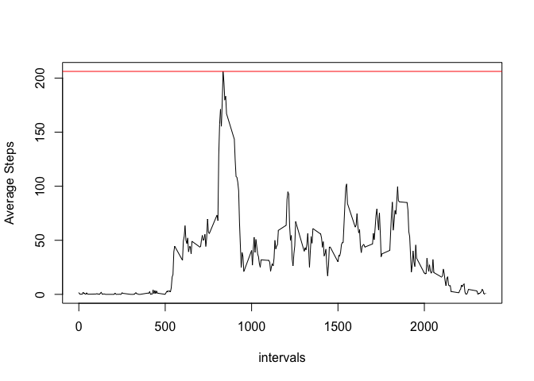
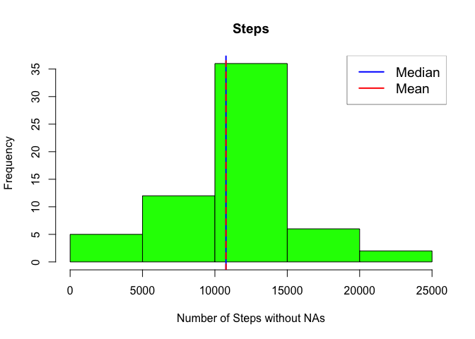

# Reproducible Research: Peer Assessment 1

## Loading and preprocessing the data

```r
library(dplyr)
```

```
## 
## Attaching package: 'dplyr'
```

```
## The following objects are masked from 'package:stats':
## 
##     filter, lag
```

```
## The following objects are masked from 'package:base':
## 
##     intersect, setdiff, setequal, union
```

```r
library(lattice)
setwd("/Users/moufkir/Desktop/00-Coursera/Data_Science_Spesialization/Reproducible/W2A/RepData_PeerAssessment1/")
df<-read.csv("activity.csv", header = T, na.strings = "NA")
##df<-df[complete.cases(df),]
```

## What is mean total number of steps taken per day?


```r
day<-group_by(df, date)
stepsDays<- summarise(day, nsteps=sum(steps, na.rm = T))
hist(stepsDays$nsteps, col = "gray", xlab = "Number of Steps", main = "Steps")
```

<!-- -->

```r
mean(day$steps, na.rm = TRUE)
```

```
## [1] 37.3826
```

```r
median(day$steps, na.rm = TRUE)
```

```
## [1] 0
```


## What is the average daily activity pattern?


```r
intervals <- group_by(df, interval)
intSteps<- summarise(intervals, average.steps = mean(steps, na.rm = TRUE))
plot(intSteps$interval, intSteps$average.steps, type="l", xlab = "intervals", ylab = "Average Steps") 
```

<!-- -->

```r
filter(intSteps, average.steps==max(average.steps))
```

```
## # A tibble: 1 × 2
##   interval average.steps
##      <int>         <dbl>
## 1      835      206.1698
```


## Imputing missing values
### The total number of NAs

```r
 sum(is.na(df$steps))
```

```
## [1] 2304
```
### Devising the strategy for NAs values

```r
newdf<-df
for(intrv in intSteps$interval) {
  intrvMean <- as.numeric(intSteps[intSteps$interval==intrv,"average.steps"])
  len<- length(newdf[is.na(newdf$steps) & newdf$interval==intrv,"steps"])
 ## if(len >0){
   newdf[is.na(newdf$steps) & newdf$interval==intrv,"steps"]<-rep(intrvMean,len)
##  }
}

##write.table(newdf,file = "nonaactivity.csv", quote = F, sep = ";")

## Ploting the histogram
day<-group_by(newdf, date)
stepsDays<- summarise(day, nsteps=sum(steps, na.rm = T))
hist(stepsDays$nsteps, col = "green", xlab = "Number of Steps without NAs", main = "Steps")
```

<!-- -->

```r
mean(day$steps, na.rm = TRUE)
```

```
## [1] 37.3826
```

```r
median(day$steps, na.rm = TRUE)
```

```
## [1] 0
```


## Are there differences in activity patterns between weekdays and weekends?
###Create a new factor variable weekdays

```r
Sys.setlocale("LC_TIME", "en_US")
```

```
## [1] "en_US"
```

```r
wend<-c("Saturday", "Sunday")
##wend<-c("Samedi", "Dimanche")
newdf$weekdays<-sapply(weekdays(as.Date(newdf$date)), function(x) {ifelse(sum(grepl(x,wend, ignore.case = T))==0,"weekday","weekend")})
print(head(newdf))
```

```
##       steps       date interval weekdays
## 1 1.7169811 2012-10-01        0  weekday
## 2 0.3396226 2012-10-01        5  weekday
## 3 0.1320755 2012-10-01       10  weekday
## 4 0.1509434 2012-10-01       15  weekday
## 5 0.0754717 2012-10-01       20  weekday
## 6 2.0943396 2012-10-01       25  weekday
```

###Make a panel plot containing a time series plot

```r
stepsByIntrv<- newdf %>% group_by(interval, weekdays) %>% summarise(average.steps = mean(steps, na.rm = TRUE))
##plot(intSteps$interval, intSteps$average.steps, type="l", xlab = "intervals", ylab = "Average Steps") 

with(stepsByIntrv,xyplot(average.steps  ~ interval | weekdays , type ="l" , layout = c(1,2), ylab = "Number of steps"))
```

<!-- -->


